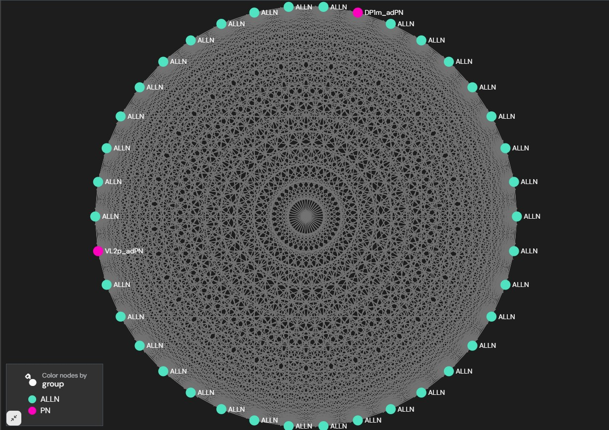
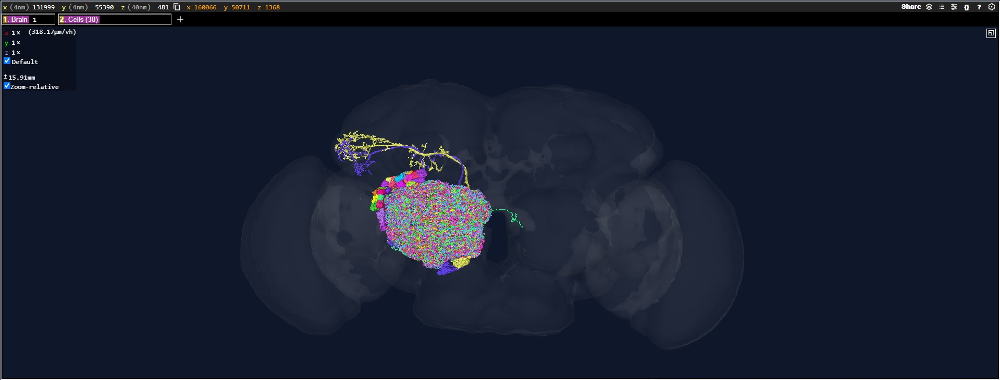

# A conserved reciprocal circuit in the *Drosophila* antennal lobe
**Dataset: FAFB (FlyWire v783).** Largest bidirectional clique common to three connectomes (BANC, FAFB, MCNS); **N = 38**.

 
*38-neuron clique (FAFB). Cyan = antennal-lobe local neurons, magenta = projection neurons. All 1,406 ordered edges present (100% reciprocity); arrows omitted for legibility.*

 
*Same 38 neurons in the FAFB brain (Codex header: Cells 38). Dense mass = left antennal lobe; the two projection neurons are the only members leaving the lobe.*

## The circuit and what it does
The 38 neurons form a complete reciprocal clique — every neuron connects to every other in both directions. By the FlyWire annotations (Schlegel et al., 2024), 36 are **antennal-lobe local neurons** (lLN1/lLN2 families) and 2 are **projection neurons** (DP1m_adPN, VL2p_adPN). The antennal lobe is the fly's first olfactory relay; its local neurons are broadly multiglomerular and densely interconnected, implementing **lateral inhibition and gain control** across glomeruli (Olsen & Wilson, 2008; Wilson, 2013). That biology is the direct cause of the structure: a population wired to contact nearly all its neighbours, both ways, *is* a near-complete reciprocal clique.

## Observations
- The same clique recurs in a female brain (FAFB), a male CNS (MCNS), and a brain-and-cord dataset (BANC). Using cell-type labels, **26 of 38 neurons are the same cell type across all three** (35/38 for FAFB–MCNS) — so the match reflects shared cell identity, not just wiring shape.
- It is locally exceptional: these graphs are otherwise feedforward-biased (reciprocity ~15%; 2-paths close feedforward 2–4× more than cyclically). The clique is a dense recurrent island in an otherwise feedforward network.

## Interpretation
I read the 38-neuron reciprocal core as the recurrent inhibitory backbone of the antennal lobe, with its all-to-all reciprocity as the substrate for divisive normalisation / gain control — a computation that requires exactly this dense mutual connectivity. That the same wiring, built from largely the same cell types, recurs across sex and across very different preparations suggests it is a conserved, hard-wired feature of early olfactory processing rather than an individual quirk. This is a structure-to-function prediction in the spirit of Seung (2024), to be tested physiologically.

*Caveats: BANC and FAFB are both brain tissue, so the clean cross-condition contrast is male (MCNS) vs female (FAFB); predicted neurotransmitters are classifier outputs, not measurements; the 12 unmatched rows are real cross-dataset differences.*

## References
Dorkenwald et al., *Nature* (2024), doi:10.1038/s41586-024-07558-y · Schlegel et al., *Nature* (2024), doi:10.1038/s41586-024-07686-5 · Olsen & Wilson, *Nature* 452:956 (2008) · Wilson, *Annu. Rev. Neurosci.* 36:217 (2013) · Eckstein, Bates et al., *Cell* (2024), doi:10.1016/j.cell.2024.03.016 · Seung, *Nature* (2024) · Codex, dx.doi.org/10.13140/RG.2.2.35928.67844
